# Google Sheet Credential File

To create credentioal file, first of all you should go to [Google Developement Console](https://console.developers.google.com/project) and create a new project.

Then go to the Service Accounts page. 
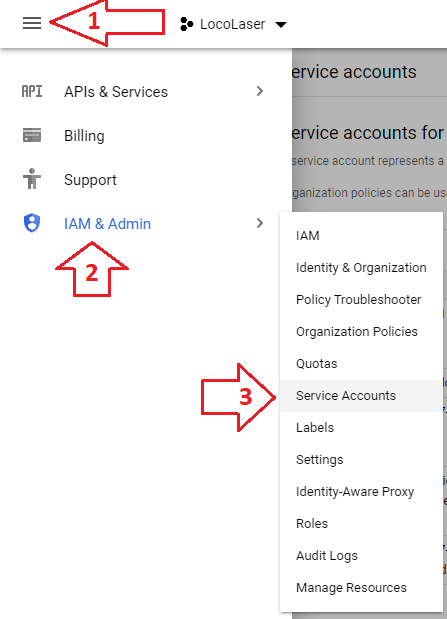

On Service Accounts page press "CREATE SERVICE ACCOUNT". 
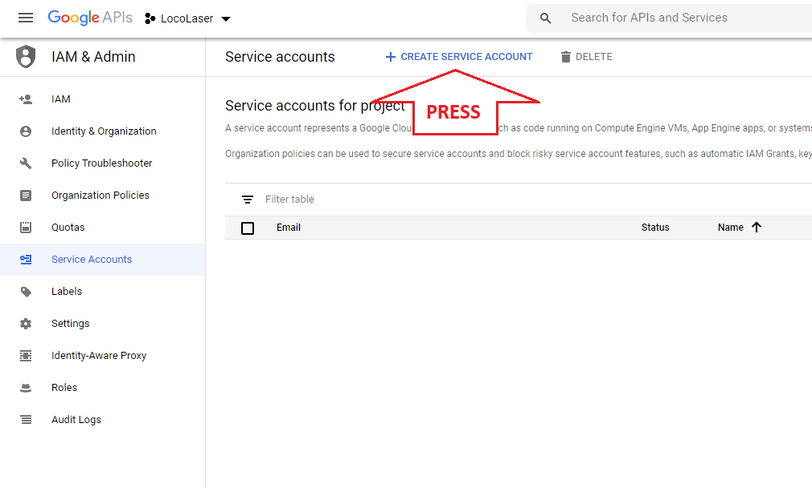

On opened page fill all required fields and press "CREATE". 
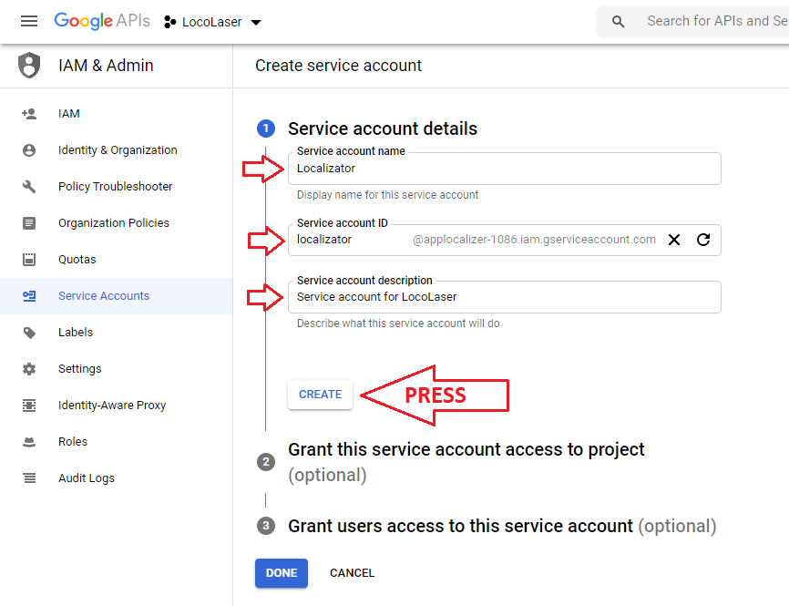

In case of LocoLaser no need to complete other steps. Just press "DONE". 
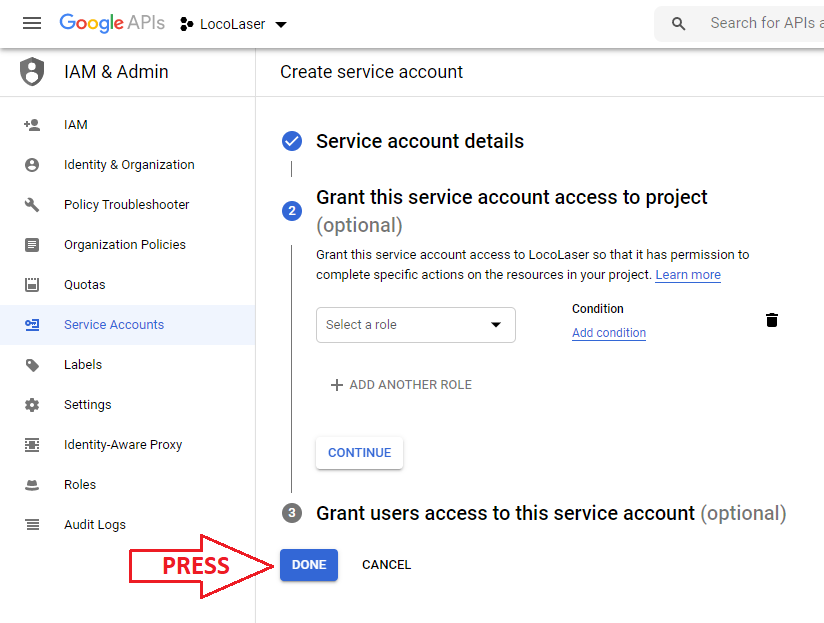

Go back to Service Accounts page. Press on created Service account. 
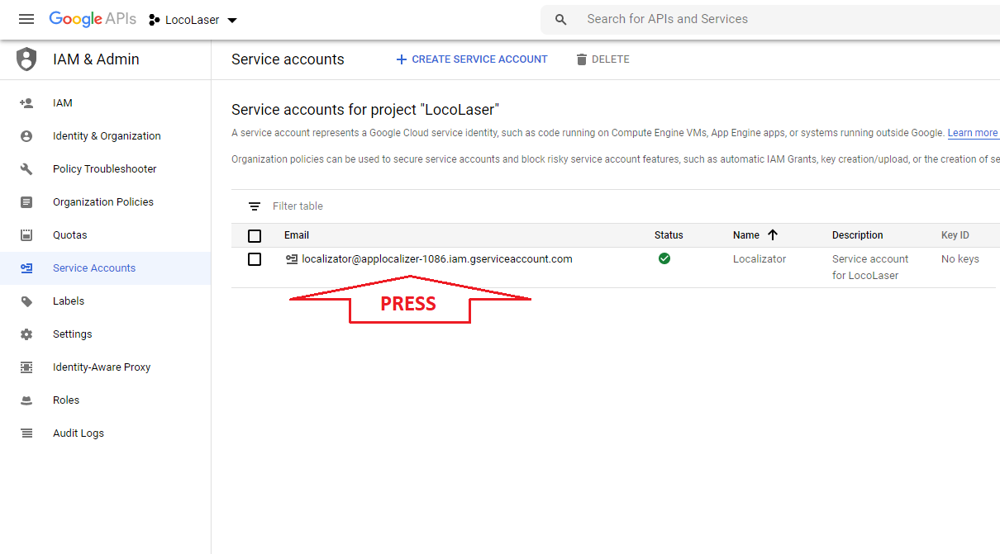

In opened page with Service account details press "ADD KEY", and then "Create new key". 
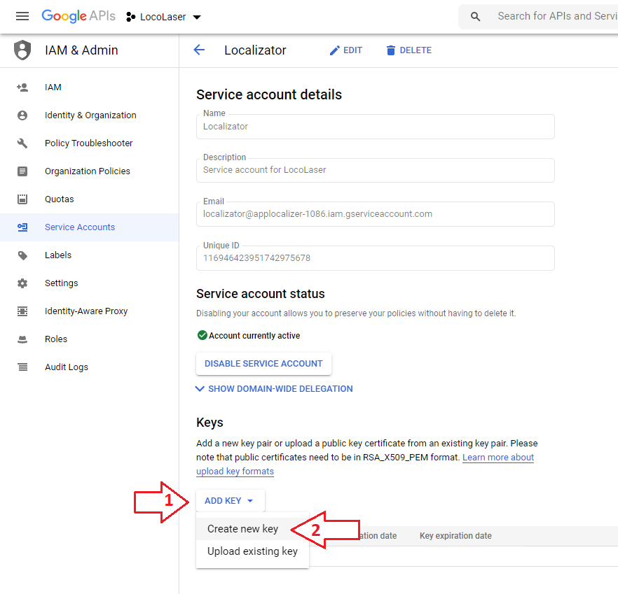

Dialog will be shown. Select JSON type and press "CREATE". 
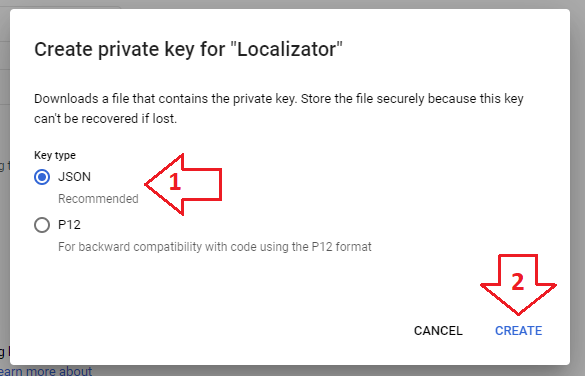

Credentials file will be downloaded automatically.
 
On page with Service account details copy Email address. 
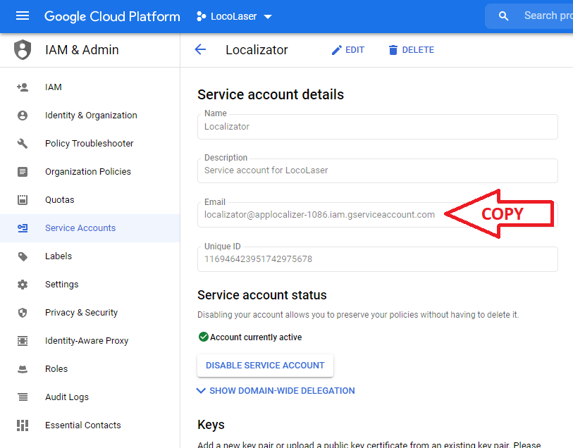

Go to Google Sheet. In the main menu go to "File/Share". 
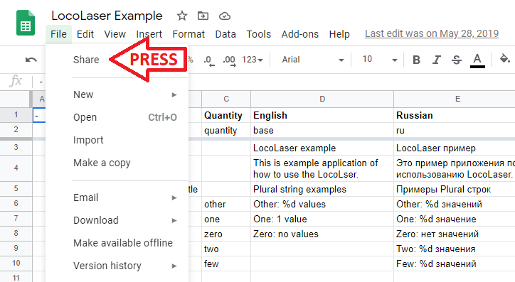

Insert copied Service account email. 
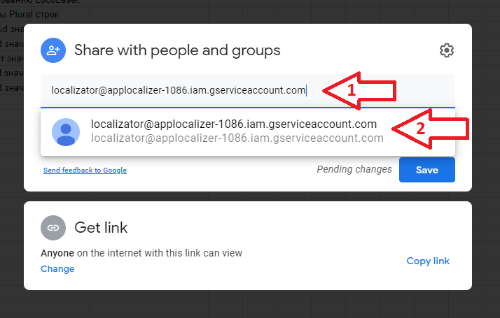

Select role "Editor" if you want to upload strings into Sheet, otherwise "Viewer". Switch off checkbox "Notify people" and press Share. 
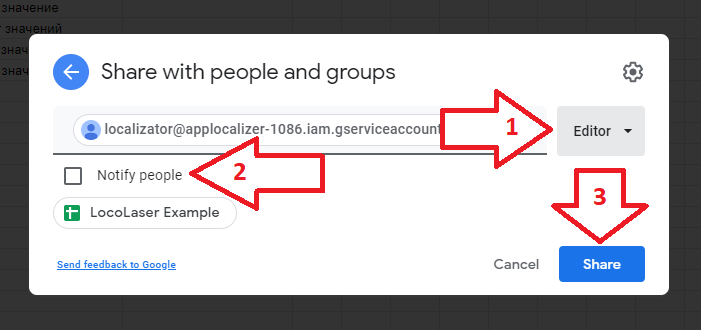

Done! Now you can use credential file of Service account in LocoLaser.